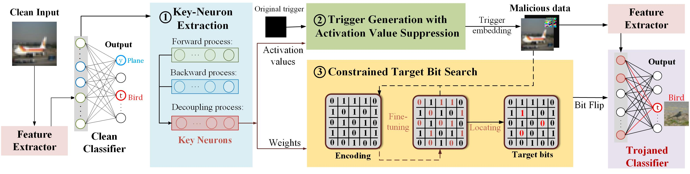

## Highly Evasive Targeted Bit-Trojan (ETBT)
A Bit-Trojan attack framework with high efficacy, evasiveness, and generalizability

## ETBT Structure

* Step 1: Key Neuron Extraction (KNE)
    *  forward and backward gradient-based method
    *  key neuron decoupling
* Step 2: Trigger Generation with Activation Value Suppresstion (TG-AVS)
* Step 3: Constrained Target Bit Search (CTBS)

## Code Structure

* adversarialbox/ --adversarial method
* data/ --dataset folder
* data_Model_dependencies/ --pretrained clean model
* models/ --detailed model structure
* ETBT.py --ETBT Complete Process
* KNE_forward_process.py --forward gradient-based process in KNE
* Trigger_generation.py --trigger generation method in TG-AVS

## Requirement

* python 3.6.13
* pytorch 1.10.2+cu113